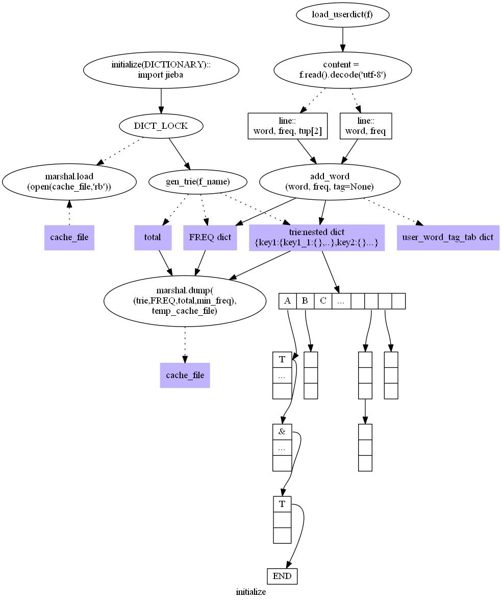

# [语言云（语言技术平台云）](https://www.ltp-cloud.com/)

基于云计算技术的中文自然语言处理服务平台

[Language Technology Platform Cloud](https://www.ltp-cloud.com/intro_en)

“语言云” 以哈工大社会计算与信息检索研究中心研发的 “语言技术平台（LTP）” 为基础，为用户提供高效精准的中文自然语言处理云服务。 使用 “语言云” 非常简单，只需要根据 API 参数构造 HTTP 请求即可在线获得分析结果，而无需下载 SDK 、无需购买高性能的机器，同时支持跨平台、跨语言编程等。 2014年11月，哈工大联合科大讯飞公司共同推出 “哈工大-讯飞语言云”，借鉴了讯飞在全国性大规模云计算服务方面的丰富经验，显著提升 “语言云” 对外服务的稳定性和吞吐量，为广大用户提供电信级稳定性和支持全国范围网络接入的语言云服务，有效支持包括中小企业在内开发者的商业应用需要。

有关更多语言云API的使用方法，请参考：http://www.ltp-cloud.com/document

[LTP主页](https://ltp.ai/index.html)

[hanlp](https://github.com/hankcs/HanLP)

[jieba-Chinese Words Segmentation Utilities](https://github.com/fxsjy/jieba)

~~~python
import hanlp
HanLP = hanlp.pipeline() \
    .append(hanlp.utils.rules.split_sentence, output_key='sentences') \
    .append(hanlp.load('FINE_ELECTRA_SMALL_ZH'), output_key='tok') \
    .append(hanlp.load('CTB9_POS_ELECTRA_SMALL'), output_key='pos') \
    .append(hanlp.load('MSRA_NER_ELECTRA_SMALL_ZH'), output_key='ner', input_key='tok') \
    .append(hanlp.load('CTB9_DEP_ELECTRA_SMALL', conll=0), output_key='dep', input_key='tok')\
    .append(hanlp.load('CTB9_CON_ELECTRA_SMALL'), output_key='con', input_key='tok')
HanLP('2021年HanLPv2.1为生产环境带来次世代最先进的多语种NLP技术。阿婆主来到北京立方庭参观自然语义科技公司。')
~~~

以上运行时，下载文件中断
Downloading https://file.hankcs.com/hanlp/dep/ctb9_dep_electra_small_20220216_100306.zip to /home/liux/.hanlp/dep/ctb9_dep_electra_small_20220216_100306.zip
。

Please re-try or download it to /home/liux/.hanlp/dep/ctb9_dep_electra_small_20220216_100306.zip by yourself with:

	wget https://file.hankcs.com/hanlp/dep/ctb9_dep_electra_small_20220216_100306.zip -O /home/liux/.hanlp/dep/ctb9_dep_electra_small_20220216_100306.zip

## 要进行什么样的语言分析

一本书或一篇文章，分割成章节，每个章节分割成段落，每个段落分行，每行再分词。

### 1. 分词

中文分词 (Word Segmentation, WS) 指的是将汉字序列切分成词序列。 因为在汉语中，词是承载语义的最基本的单元。分词是信息检索、文本分类、情感分析等多项中文自然语言处理任务的基础。 

### 2. 词性标注

词性标注(Part-of-speech Tagging, POS)是给句子中每个词一个词性类别的任务。 这里的词性类别可能是名词、动词、形容词或其他。 下面的句子是一个词性标注的例子。 其中，v代表动词、n代表名词、c代表连词、d代表副词、wp代表标点符号。 

### 3. 命名实体识别

命名实体识别 (Named Entity Recognition, NER) 是在句子的词序列中定位并识别人名、地名、机构名等实体的任务。
命名实体识别对于挖掘文本中的实体进而对其进行分析有很重要的作用。

命名实体识别的类型一般是根据任务确定的。LTP提供最基本的三种实体类型人名、地名、机构名的识别。 用户可以很容易将实体类型拓展成品牌名、软件名等实体类型。

### 4. 依存句法分析

依存语法 (Dependency Parsing, DP) 通过分析语言单位内成分之间的依存关系揭示其句法结构。 直观来讲，依存句法分析识别句子中的“主谓宾”、“定状补”这些语法成分，并分析各成分之间的关系。仍然是上面的例子，其分析结果为：

从分析结果中我们可以看到，句子的核心谓词为“提出”，主语是“李克强”，提出的宾语是“支持上海…”，“调研…时”是“提出”的 (时间) 状语，“李克强”的修饰语是“国务院总理”，“支持”的宾语是“探索 新机制”。有了上面的句法分析结果，我们就可以比较容易的看到，“提出者”是“李克强”，而不是“上海”或“外高桥”，即使它们都是名词，而且距离“提出”更近。

依存句法分析标注关系 (共15种) 及含义如下：
关系类型 	Tag 	Description 	Example
主谓关系 	SBV 	subject-verb 	我送她一束花 (我 <-- 送)
动宾关系 	VOB 	直接宾语，verb-object 	我送她一束花 (送 --> 花)
间宾关系 	IOB 	间接宾语，indirect-object 	我送她一束花 (送 --> 她)
前置宾语 	FOB 	前置宾语，fronting-object 	他什么书都读 (书 <-- 读)
兼语 	DBL 	double 	他请我吃饭 (请 --> 我)
定中关系 	ATT 	attribute 	红苹果 (红 <-- 苹果)
状中结构 	ADV 	adverbial 	非常美丽 (非常 <-- 美丽)
动补结构 	CMP 	complement 	做完了作业 (做 --> 完)
并列关系 	COO 	coordinate 	大山和大海 (大山 --> 大海)
介宾关系 	POB 	preposition-object 	在贸易区内 (在 --> 内)
左附加关系 	LAD 	left adjunct 	大山和大海 (和 <-- 大海)
右附加关系 	RAD 	right adjunct 	孩子们 (孩子 --> 们)
独立结构 	IS 	independent structure 	两个单句在结构上彼此独立
标点 	WP 	punctuation 	。
核心关系 	HED 	head 	指整个句子的核心

### 5. 语义角色标注

语义角色标注 (Semantic Role Labeling, SRL) 是一种浅层的语义分析技术，标注句子中某些短语为给定谓词的论元 (语义角色) ，如施事、受事、时间和地点等。其能够对问答系统、信息抽取和机器翻译等应用产生推动作用。 仍然是上面的例子，语义角色标注的结果为：

其中有三个谓词提出，调研和探索。以探索为例，积极是它的方式（一般用ADV表示），而新机制则是它的受事（一般用A1表示）

核心的语义角色为 A0-5 六种，A0 通常表示动作的施事，A1通常表示动作的影响等，A2-5 根据谓语动词不同会有不同的语义含义。其余的15个语义角色为附加语义角色，如LOC 表示地点，TMP 表示时间等。附加语义角色列表如下：
标记 	说明
ADV 	adverbial, default tag ( 附加的，默认标记 )
BNE 	beneficiary ( 受益人 )
CND 	condition ( 条件 )
DIR 	direction ( 方向 )
DGR 	degree ( 程度 )
EXT 	extent ( 扩展 )
FRQ 	frequency ( 频率 )
LOC 	locative ( 地点 )
MNR 	manner ( 方式 )
PRP 	purpose or reason ( 目的或原因 )
TMP 	temporal ( 时间 )
TPC 	topic ( 主题 )
CRD 	coordinated arguments ( 并列参数 )
PRD 	predicate ( 谓语动词 )
PSR 	possessor ( 持有者 )
PSE 	possessee ( 被持有 )

### 6. 语义依存分析

语义依存分析 (Semantic Dependency Parsing, SDP)，分析句子各个语言单位之间的语义关联，并将语义关联以依存结构呈现。 使用语义依存刻画句子语义，好处在于不需要去抽象词汇本身，而是通过词汇所承受的语义框架来描述该词汇，而论元的数目相对词汇来说数量总是少了很多的。语义依存分析目标是跨越句子表层句法结构的束缚，直接获取深层的语义信息。 例如以下三个句子，用不同的表达方式表达了同一个语义信息，即张三实施了一个吃的动作，吃的动作是对苹果实施的。

语义依存分析不受句法结构的影响，将具有直接语义关联的语言单元直接连接依存弧并标记上相应的语义关系。这也是语义依存分析与句法依存分析的重要区别。

如上例对比了句法依存和语义分析的结果，可以看到两者存在两个显著差别。第一，句法依存某种程度上更重视非实词（如介词）在句子结构分析中的作用，而语义依存更倾向在具有直接语义关联的实词之间建立直接依存弧，非实词作为辅助标记存在。 第二，两者依存弧上标记的语义关系完全不同，语义依存关系是由论元关系引申归纳而来，可以用于回答问题，如我在哪里喝汤，我在用什么喝汤，谁在喝汤，我在喝什么。但是句法依存却没有这个能力。

语义依存与语义角色标注之间也存在关联，语义角色标注只关注句子主要谓词的论元及谓词与论元之间的关系，而语义依存不仅关注谓词与论元的关系，还关注谓词与谓词之间、论元与论元之间、论元内部的语义关系。语义依存对句子语义信息的刻画更加完整全面。

语义依存关系分为三类，分别是主要语义角色，每一种语义角色对应存在一个嵌套关系和反关系；事件关系，描述两个事件间的关系；语义依附标记，标记说话者语气等依附性信息。
关系类型 	Tag 	Description 	Example
施事关系 	Agt 	Agent 	我送她一束花 (我 <-- 送)
当事关系 	Exp 	Experiencer 	我跑得快 (跑 --> 我)
感事关系 	Aft 	Affection 	我思念家乡 (思念 --> 我)
领事关系 	Poss 	Possessor 	他有一本好读 (他 <-- 有)
受事关系 	Pat 	Patient 	他打了小明 (打 --> 小明)
客事关系 	Cont 	Content 	他听到鞭炮声 (听 --> 鞭炮声)
成事关系 	Prod 	Product 	他写了本小说 (写 --> 小说)
源事关系 	Orig 	Origin 	我军缴获敌人四辆坦克 (缴获 --> 坦克)
涉事关系 	Datv 	Dative 	他告诉我个秘密 ( 告诉 --> 我 )
比较角色 	Comp 	Comitative 	他成绩比我好 (他 --> 我)
属事角色 	Belg 	Belongings 	老赵有俩女儿 (老赵 <-- 有)
类事角色 	Clas 	Classification 	他是中学生 (是 --> 中学生)
依据角色 	Accd 	According 	本庭依法宣判 (依法 <-- 宣判)
缘故角色 	Reas 	Reason 	他在愁女儿婚事 (愁 --> 婚事)
意图角色 	Int 	Intention 	为了金牌他拼命努力 (金牌 <-- 努力)
结局角色 	Cons 	Consequence 	他跑了满头大汗 (跑 --> 满头大汗)
方式角色 	Mann 	Manner 	球慢慢滚进空门 (慢慢 <-- 滚)
工具角色 	Tool 	Tool 	她用砂锅熬粥 (砂锅 <-- 熬粥)
材料角色 	Malt 	Material 	她用小米熬粥 (小米 <-- 熬粥)
时间角色 	Time 	Time 	唐朝有个李白 (唐朝 <-- 有)
空间角色 	Loc 	Location 	这房子朝南 (朝 --> 南)
历程角色 	Proc 	Process 	火车正在过长江大桥 (过 --> 大桥)
趋向角色 	Dir 	Direction 	部队奔向南方 (奔 --> 南)
范围角色 	Sco 	Scope 	产品应该比质量 (比 --> 质量)
数量角色 	Quan 	Quantity 	一年有365天 (有 --> 天)
数量数组 	Qp 	Quantity-phrase 	三本书 (三 --> 本)
频率角色 	Freq 	Frequency 	他每天看书 (每天 <-- 看)
顺序角色 	Seq 	Sequence 	他跑第一 (跑 --> 第一)
描写角色 	Desc(Feat) 	Description 	他长得胖 (长 --> 胖)
宿主角色 	Host 	Host 	住房面积 (住房 <-- 面积)
名字修饰角色 	Nmod 	Name-modifier 	果戈里大街 (果戈里 <-- 大街)
时间修饰角色 	Tmod 	Time-modifier 	星期一上午 (星期一 <-- 上午)
反角色 	r + main role 		打篮球的小姑娘 (打篮球 <-- 姑娘)
嵌套角色 	d + main role 		爷爷看见孙子在跑 (看见 --> 跑)
并列关系 	eCoo 	event Coordination 	我喜欢唱歌和跳舞 (唱歌 --> 跳舞)
选择关系 	eSelt 	event Selection 	您是喝茶还是喝咖啡 (茶 --> 咖啡)
等同关系 	eEqu 	event Equivalent 	他们三个人一起走 (他们 --> 三个人)
先行关系 	ePrec 	event Precedent 	首先，先
顺承关系 	eSucc 	event Successor 	随后，然后
递进关系 	eProg 	event Progression 	况且，并且
转折关系 	eAdvt 	event adversative 	却，然而
原因关系 	eCau 	event Cause 	因为，既然
结果关系 	eResu 	event Result 	因此，以致
推论关系 	eInf 	event Inference 	才，则
条件关系 	eCond 	event Condition 	只要，除非
假设关系 	eSupp 	event Supposition 	如果，要是
让步关系 	eConc 	event Concession 	纵使，哪怕
手段关系 	eMetd 	event Method 	
目的关系 	ePurp 	event Purpose 	为了，以便
割舍关系 	eAban 	event Abandonment 	与其，也不
选取关系 	ePref 	event Preference 	不如，宁愿
总括关系 	eSum 	event Summary 	总而言之
分叙关系 	eRect 	event Recount 	例如，比方说
连词标记 	mConj 	Recount Marker 	和，或
的字标记 	mAux 	Auxiliary 	的，地，得
介词标记 	mPrep 	Preposition 	把，被
语气标记 	mTone 	Tone 	吗，呢
时间标记 	mTime 	Time 	才，曾经
范围标记 	mRang 	Range 	都，到处
程度标记 	mDegr 	Degree 	很，稍微
频率标记 	mFreq 	Frequency Marker 	再，常常
趋向标记 	mDir 	Direction Marker 	上去，下来
插入语标记 	mPars 	Parenthesis Marker 	总的来说，众所周知
否定标记 	mNeg 	Negation Marker 	不，没，未
情态标记 	mMod 	Modal Marker 	幸亏，会，能
标点标记 	mPunc 	Punctuation Marker 	，。！
重复标记 	mPept 	Repetition Marker 	走啊走 (走 --> 走)
多数标记 	mMaj 	Majority Marker 	们，等
实词虚化标记 	mVain 	Vain Marker 	
离合标记 	mSepa 	Seperation Marker 	吃了个饭 (吃 --> 饭) 洗了个澡 (洗 --> 澡)
根节点 	Root 	Root 	全句核心节点

### jieba 中文分词组件中的HMM模型和Viterbi算法应用

[jieba实践介绍](https://www.freesion.com/article/5421329003/)