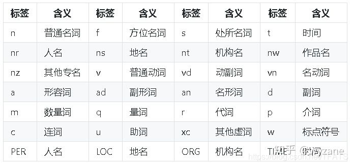
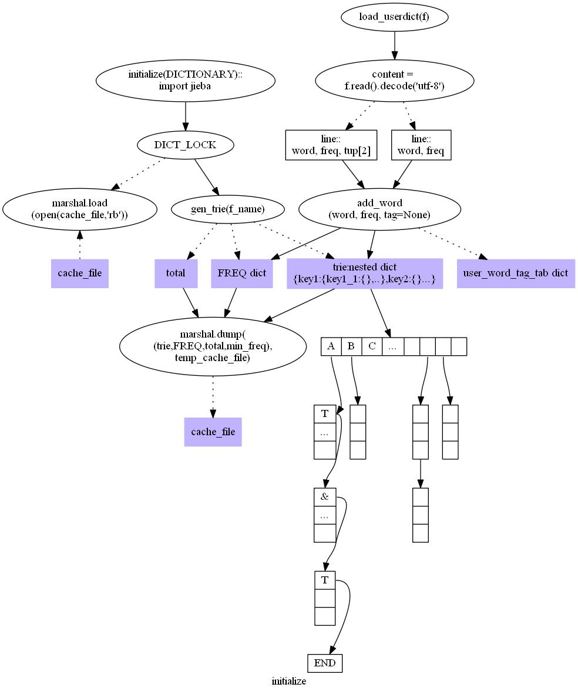

# NLP自然语言处理中的中文分词介绍

## 1. LTP进行中文分词

[LTP 4](https://ltp.ai/index.html) --（Language Technology Platform） 提供了一系列中文自然语言处理工具，用户可以使用这些工具对于中文文本进行分词、词性标注、句法分析等等工作。

> @article{che2020n,
  title={N-LTP: A Open-source Neural Chinese Language Technology Platform with Pretrained Models},
  author={Che, Wanxiang and Feng, Yunlong and Qin, Libo and Liu, Ting},
  journal={arXiv preprint arXiv:2009.11616},
  year={2020}
}

ltp==4.1.5.post2

### Python 中安装 ltp

采用 `pip install ltp`

### 默认加载 Small 模型

~~~python
from ltp import LTP
ltp = LTP()  # 默认加载 Small 模型
# ltp = LTP(path = "base|small|tiny")
# ltp = LTP(path = "tiny.tgz|tiny-tgz-extracted") 
# 其中 tiny-tgz-extracted 是 tiny.tgz 解压出来的文件夹
seg, hidden = ltp.seg(["他叫汤姆去拿外衣。"])
pos = ltp.pos(hidden)
ner = ltp.ner(hidden)
srl = ltp.srl(hidden)
dep = ltp.dep(hidden)
sdp = ltp.sdp(hidden)
~~~

## 2. Jieba结巴中文分词

[结巴分词](https://github.com/fxsjy/jieba)目前使用比较广泛，是一个不错的学习NLP的理想Python软件包。

[jieba-Chinese Words Segmentation Utilities](https://github.com/fxsjy/jieba)

分词是NLP处理的第一步，也是最基本的任务，分词的好坏直接决定了后面语义分析的精准度。

所谓分词就是将一段表述里的词汇进行分解。  
比如“我爱中国”，分解后有三个词：我、爱、中国，词性分别是名词、动词、名词。

$\bold{jieba的分词原理分析}$

- 初始化。加载词典文件，获取每个词语和它出现的词数
- 切分短语。利用正则，将文本切分为一个个语句，之后对语句进行分词
- 构建DAG。通过字符串匹配，构建所有可能的分词情况的**有向无环图**，也就是`DAG`
- 构建节点最大路径概率，以及结束位置。计算每个汉字节点到语句结尾的所有路径中的最大概率，并记下最大概率时在DAG中对应的该汉字成词的结束位置。
- 构建切分组合。根据节点路径，得到词语切分的结果，也就是分词结果。
- HMM 新词处理：对于新词，也就是jieba词典中没有的词语，我们通过统计方法来处理，jieba中采用了**HMM（隐马尔科夫模型）**来处理。
- 返回分词结果：通过 `yield` 将上面步骤中切分好的词语逐个返回。`yield` 相对于`list`，可以节约存储空间。

HMM模型：隐马尔可夫模型

jieba支持简繁体汉字分词，支持自定义词典，支持MIT授权协议（开源软件许可协议）

### 2.1 jieba库中用于分词的三个方法

三种分词模式

- 精确模式，试图将句子最精确地切开，适合文本分析；
- 全模式，把句子中所有的可以成词的词语都扫描出来, 速度非常快，但是不能解决歧义；
- 搜索引擎模式，在精确模式的基础上，对长词再次切分，提高召回率，适合用于搜索引擎分词。

可使用 `jieba.cut` 和 `jieba.cut_for_search` 方法进行分词，两者所返回的结构都是一个可迭代的 `generator`，可使用 `for` 循环来获得分词后得到的每一个词语（unicode），或者直接使用 `jieba.lcut` 以及 `jieba.lcut_for_search` 返回 `list`。

`jieba.Tokenizer(dictionary=DEFAULT_DICT)` ：使用该方法可以自定义分词器，可以同时使用不同的词典。`jieba.dt` 为默认分词器，所有全局分词相关函数都是该分词器的映射。

注意: 尽量不要使用 GBK 字符串，可能无法预料地错误解码成 UTF-8。

#### 2.1.1 结巴中文分词全模式和精确模式

采用 `jieba.cut，jieba.lcut(strs, cut_ll=False, HMM=True, use_paddle='')`

给定中文字符串，分解后返回一个迭代器(generator)，这种方式提高速度，节省空间。但是需要用 `for` 循环访问 或者 `list()` 命令获取列表信息。

参数解释：

- 「strs」：   需要分词的字符串；
- 「cut_all」：用来控制是否采用全模式；
- 「HMM」：用来控制是否使用 HMM 模型；
- 「use_paddle」：用来控制是否使用paddle模式下的分词模式，paddle模式采用延迟加载方式，通过enable_paddle接口安装paddlepaddle-tiny，并且import相关代码；

这里区分**全模式和精确模式**，举个例子先看看区别：

~~~python
# filename: jieba01-wordsegment.py 结巴分词的三种模式选择测试

sentence = "中国上海是一座美丽的国际性大都市"
seg_full = jieba.cut(sentence, cut_all=True)  
# 全模式 Full mode
print("全模式: " + "/ ".join(seg_full))  # 或 list(seg_full)

# 返回结果
>>> 全模式: 中国/ 上海/ 是/ 一座/ 美丽/ 的/ 国际/ 国际性/ 大都/ 大都市/ 都市

# 精确模式 Default mode
words = jieba.cut(sentence, cut_all=False)
print("精确模式: " + "/ ".join(words))  # list(words)

# 返回结果
>>> 精确模式: 中国/ 上海/ 是/ 一座/ 美丽/ 的/ 国际性/ 大都市
~~~

可以看到，全模式把句子中所有的可以成词的词语都扫描出来, 会出现一词多用、一词多意。精确模式将句子最精确的切分开，每个词都只有一种含义。

`jieba.cut`，`jieba.lcut` 方法默认是精确模式。

还有一个参数控制`paddle` 模式，会更加精确，使用这个的前提是你需要先安装`paddlepaddle-tiny`。

安装命令：`pip install paddlepaddle-tiny==1.6.1`  
详情可以去官网看下，这里不举例。

#### 2.1.2 结巴分词的搜索引擎模式

采用 `jieba.cut_for_search，jieba.lcut_for_search(strs, HMM=True)`

该方法和cut一样，分解后返回一个迭代器generator，需要用 for 循环访问。  
不过它是搜索引擎模式，在精确模式的基础上，对长词再次切分，提高召回率，适合用于搜索引擎分词。

参数解释：

- 「strs」：需要分词的字符串；
- 「HMM」：是否使用 HMM 模型，默认值为 True。该方法适合用于搜索引擎构建倒排索引的分词，粒度比较细。

~~~python
# 搜索引擎模式
sentence = "中国上海是一座美丽的国际性大都市，拥有复旦大学、上海交通大学等知名高等学府"
seg_list = jieba.cut_for_search(sentence)  
print(", ".join(seg_list))

# 返回结果
Search Mode: 中国, 上海, 是, 一座, 美丽, 的, 国际, 国际性, 大都, 都市, 大都市, ，, 拥有, 复旦, 大学, 复旦大学, 、, 上海, 交通, 大学, 上海交通大学, 等, 知名, 高等, 学府, 高等学府
~~~

#### 2.1.3 结巴分词返回列表

采用 `jieba.lcut ， jieba.lcut_for_search`

和 `jieba.cut` 使用方法一样，不过返回的是**列表**。

~~~python
>>> sens = "中国上海是一座美丽的国际性大都市，拥有复旦大学、上海交通大学等知名高等学府"
>>> seg_list = jieba.cut_for_search(sens)
>>> print(','.join(seg_list))
中国,上海,是,一座,美丽,的,国际,国际性,大都,都市,大都市,，,拥有,复旦,大学,复旦大学,、,上海,交通,大学,上海交通大学,等,知名,高等,学府,高等学府
>>> seg_lcut = jieba.lcut(sens)
>>> print(','.join(seg_lcut))
中国,上海,是,一座,美丽,的,国际性,大都市,，,拥有,复旦大学,、,上海交通大学,等,知名,高等学府
~~~

`cut` 和 `cut_for_search` 方法都是**支持繁体字**的。

### 2.2 添加自定义词典

如果是对专业新闻或者小说进行分词，会有很多的新词汇，jieba库里没有就没办法识别，那么就需要添加自定义的词汇，比如：奥利给。

添加自定义词汇的方法： `jieba.load_userdict(file_name)` 参数是文本文件，`txt、csv`都可以。

自定义词典文件的词汇格式是：

- 一个词占一行，
- 每一行分三部分：词语、词频（可省略）、词性（可省略），
- 用空格隔开，顺序不可颠倒。

如用文本编辑软件notepad (Windows) 或 gedit,nano (Ubuntu) 编辑一个文本文件，内容如下：

> 奥利给 2  
> 八佰 2 i  
> 管虎
> 砥砺前行  
> 不忘初心  

以"奥利给，管虎执导的八佰是一部让人热血沸腾的好电影。" 这段话为例， 如果不添加自定义词典，很多词没办法识别出来。

~~~python
# 不添加自定义词典
seg_list = jieba.cut("奥利给，管虎执导的八佰是一部让人热血沸腾的好电影")
print("没有自定义词典：{}".format("/ ".join(seg_list)))  

# 返回结果
奥利/ 给/ ，/ 管虎/ 执导/ 的/ 八佰是/ 一部/ 让/ 人/ 热血沸腾/ 的/ 好/ 电影
添加自定义词典后，新词、人名、电影名都可以识别出来

# 载入词典
jieba.load_userdict("userdict.txt")
seg_list = jieba.cut("奥利给，管虎执导的八佰是一部让人热血沸腾的好电影")
#jieba.add_word("奥利给")
#jieba.add_word("管虎")  临时添加新词
print("有自定义词典：{}".format("/ ".join(seg_list)))

# 返回结果
奥利给/ ，/ 管虎/ 执导/ 的/ 八佰/ 是/ 一部/ 让/ 人/ 热血沸腾/ 的/ 好/ 电影
~~~

jieba无疑是一款优秀的分词工具，而且在不断地优化成长。

### 2.3 关键词提取

可以基于 `TF-IDF` 算法进行关键词提取，也可以基于 `extRank` 算法。 `TF-IDF` 算法与 `elasticsearch` 中使用的算法是一样的。

使用 `jieba.analyse.extract_tags()` 函数进行关键词提取，其参数如下：

`jieba.analyse.extract_tags(sentence, topK=20, withWeight=False, allowPOS=())`

- sentence 为待提取的文本  
- topK 为返回几个 TF/IDF 权重最大的关键词，默认值为 20
- withWeight 为是否一并返回关键词权重值，默认值为 False
- allowPOS 仅包括指定词性的词，默认值为空，即不筛选
- jieba.analyse.TFIDF(idf_path=None) 新建 TFIDF 实例，idf_path 为 IDF 频率文件

也可以使用 jieba.analyse.TFIDF(idf_path=None) 新建 TFIDF 实例，idf_path 为 IDF 频率文件。

基于 TF-IDF 算法的关键词抽取：

~~~python
import jieba.analyse

file = "sanguo.txt"
topK = 12
content = open(file, 'rb').read()

tags = jieba.analyse.extract_tags(content, topK=topK)
print(tags)
# ['玄德', '程远志', '张角', '云长', '张飞', '黄巾', '封谞', '刘焉', '邓茂', '邹靖', '姓名', '招军']

# withWeight=True：将权重值一起返回
tags = jieba.analyse.extract_tags(content, topK=topK, withWeight=True)
print(tags)
# [('玄德', 0.1038549799467099), ('程远志', 0.07787459004363208), ('张角', 0.0722532891360849),
# ('云长', 0.07048801593691037), ('张飞', 0.060972692853113214), ('黄巾', 0.058227157790330185),
# ('封谞', 0.0563904127495283), ('刘焉', 0.05470798376886792), ('邓茂', 0.04917692565566038),
# ('邹靖', 0.04427258239705188), ('姓名', 0.04219704283997642), ('招军', 0.04182041076757075)]
~~~

上面的代码是读取文件，提取出现频率最高的前12个词。

TF-IDF的原理如下：

词频 (term frequency, TF) 指的是某一个给定的词语在该文件中出现的次数。这个数字通常会被归一化(一般是词频除以文章总词数)。

\[TF = \dfrac{\text{词 条 } W \text{出 现 的 次 数}}{\text{所 有 词 条 的 数 量}}\]

逆向文件频率 (inverse document frequency, IDF) IDF的主要思想是：如果包含词条t的文档越少, IDF越大，则说明词条具有很好的类别区分能力。某一特定词语的IDF，可以由总文件数目除以包含该词语之文件的数目，再将得到的商取对数得到。

\[ IDF = \log \frac{\text{语 料 库 文 档 总 数}}{\text{包 含 词 条 W 的 文 档 总 数}+1}\]

关键词提取所使用逆向文件频率（IDF）文本语料库，当提取的结果不是我们想要的结果时，我们可以自定义IDF文本语料库。

### 2.4 词性标注

词性标注(Part-of-speech Tagging, POS)主要是标记文本分词后每个词的词性，采用和 `ictclas` 兼容的标记法. 这里的词性类别可能是名词、动词、形容词或其他。 下面的句子是一个词性标注的例子。 其中，v代表动词、n代表名词、c代表连词、d代表副词、wp代表标点符号。 

- ictclas：汉语词法分析系统 ICTCLAS(Institute of Computing Technology, Chinese Lexical Analysis System)

使用例子如下：

~~~python
import jieba
import jieba.posseg as pseg

# 默认模式
seg_list = pseg.cut("今天哪里都没去，在家里睡了一天")
for word, flag in seg_list:
    print(word + " " + flag)
   
"""
使用 jieba 默认模式的输出结果是：
我 r
Prefix dict has been built successfully.
今天 t
吃 v
早饭 n
了 ul
"""

# paddle 模式
words = pseg.cut("我今天吃早饭了", use_paddle=True)
"""
使用 paddle 模式的输出结果是：
我 r
今天 TIME
吃 v
早饭 n
了 xc
"""
~~~

paddle模式的词性对照表如下：

### 2.5 获取词语位置

将分本分词后，返回每个词和该词在原文中的起始位置，例子如下：

~~~python
import jieba

result = jieba.tokenize('今天哪里都没去，在家里睡了一天')
for tk in result:
    print("word:" + tk[0] +
          " start:" + str(tk[1]) +
          " end:" + str(tk[2]))
    
"""
word:华为技术有限公司 start:0 end:8
word:的 start:8 end:9
word:手机 start:9 end:11
word:品牌 start:11 end:13
"""

# 使用 search 模式
result = jieba.tokenize('华为技术有限公司的手机品牌', mode="search")
for tk in result:
    print("word:" + tk[0] +
          " start:" + str(tk[1]) +
          " end:" + str(tk[2]))
"""
输出：
word:华为 start:0 end:2
word:技术 start:2 end:4
word:有限 start:4 end:6
word:公司 start:6 end:8
word:华为技术有限公司 start:0 end:8
word:的 start:8 end:9
word:手机 start:9 end:11
word:品牌 start:11 end:13
"""
~~~

### 2.6 词语词频调整

很多时候我们没有必要使用自定义词典，加大开发的难度。 因此jieba给我们提供了调整词典的函数。

通过 `jieba.add_word(word, freq=None, tag=None)` 和 `jieba.del_word(word)` 这两个函数，可以动态地增删词典。

通过 `suggest_freq(segment, tune=True)` 这个函数，可以调节单个词语的词频，使其能或不能被切分。  
例如下面案例所示：

~~~python
import jieba
sentence="我吃酸辣粉"
words="酸辣粉"
jieba.add_word(words)
jieba.suggest_freq(('酸辣粉'), tune=True)

seg_list = jieba.cut(sentence)
print('\ '.join(seg_list))
~~~

### 2.7 jieba的并行分词

将目标文本按行分隔后，把各行文本分配到多个 python进程并行分词，然后归并结果，从而获得分词速度的可观提升。  
用法：

- jieba.enable_parallel(5) # 开启并行分词模式，参数为并行进程数
- jieba.disable_parallel() # 关闭并行分词模式

jieba在其github页面提供了一组性能测试数据：

在 4 核 3.4GHz Linux 机器上，对*金庸全集*进行精确分词，获得了 1MB/s 的速度，是单进程版的 3.3 倍。

### 2.8 jieba的 Tokenize

jieba库使用返回 Tokenize 来返回词语在原文的起始位置

例如下面的案例：

~~~python
import jieba

words= jieba.tokenize('我吃酸辣粉')
for tk in words:
    print("word %s\t\t start: %d \t\t end:%d" % (tk[0], tk[1], tk[2]))
~~~

### 2.9 搜索引擎

使用 jieba 和 whoosh 可以实现搜索引擎功能。

whoosh 是由python实现的一款全文搜索工具包，可以使用 pip 安装它：

`pip install whoosh`

介绍 jieba + whoosh 实现搜索之前，你可以先看下文 whoosh 的简单介绍。

下面看一个简单的搜索引擎的例子：

~~~python
import os
import shutil

from whoosh.fields import *
from whoosh.index import create_in
from whoosh.qparser import QueryParser
from jieba.analyse import ChineseAnalyzer

analyzer = ChineseAnalyzer()

schema = Schema(title=TEXT(stored=True),
                path=ID(stored=True),
                content=TEXT(stored=True,
                             analyzer=analyzer))
if not os.path.exists("test"):
    os.mkdir("test")
else:
    # 递归删除目录
    shutil.rmtree("test")
    os.mkdir("test")

idx = create_in("test", schema)
writer = idx.writer()

writer.add_document(
    title=u"document1",
    path="/tmp1",
    content=u"Tracy McGrady is a famous basketball player, the elegant basketball style of him attract me")
writer.add_document(
    title=u"document2",
    path="/tmp2",
    content=u"Kobe Bryant is a famous basketball player too , the tenacious spirit of him also attract me")
writer.add_document(
    title=u"document3",
    path="/tmp3",
    content=u"LeBron James is the player i do not like")

writer.commit()
searcher = idx.searcher()
parser = QueryParser("content", schema=idx.schema)

for keyword in ("basketball", "elegant"):
    print("searched keyword ",keyword)
    query= parser.parse(keyword)
    results = searcher.search(query)
    for hit in results:
        print(hit.highlights("content"))
    print("="*50)
~~~

上面代码中，使用 add_document() 把一个文档添加到了 index 中。在这些文档中，搜索含有 “basketball”和 “elegant” 的文档。

打印结果如下：

> Building prefix dict from the default dictionary ...  
Loading model from cache C:\Users\wyzane\AppData\Local\Temp\jieba.cache  
Loading model cost 0.754 seconds.  
Prefix dict has been built successfully.  
searched keyword  basketball  
McGrady is a famous <b class="match term0">basketball</b> player, the elegant...<b class="match term0">basketball</b> style of him attract me  
Bryant is a famous <b class="match term0">basketball</b> player too , the tenacious  
==================================================  
searched keyword  elegant  
basketball player, the <b class="match term0">elegant</b> basketball style  
==================================================  

更换搜索词时：

~~~python
for keyword in ("LeBron", "Kobe"):
    print("searched keyword ",keyword)
    query= parser.parse(keyword)
    results = searcher.search(query)
    for hit in results:
        print(hit.highlights("content"))
    print("="*50)
~~~

搜索结果如下：

> Building prefix dict from the default dictionary ...  
Loading model from cache C:\Users\wyzane\AppData\Local\Temp\jieba.cache  
Loading model cost 0.801 seconds.  
Prefix dict has been built successfully.  
searched keyword  LeBron  
<b class="match term0">LeBron</b> James is the player i do not like  
==================================================  
searched keyword  Kobe  
<b class="match term0">Kobe</b> Bryant is a famous basketball player too , the  tenacious  
==================================================  

上面是搜索英文，下面展示下搜索中文。
添加下面的文档数据：

~~~python
writer.add_document(
    title=u"document1",
    path="/tmp1",
    content=u"麦迪是一位著名的篮球运动员，他飘逸的打法深深吸引着我")
writer.add_document(
    title=u"document2",
    path="/tmp2",
    content=u"科比是一位著名的篮球运动员，他坚韧的精神深深的感染着我")
writer.add_document(
    title=u"document3",
    path="/tmp3",
    content=u"詹姆斯是我不喜欢的运动员")
~~~

执行搜索：

~~~python
for keyword in ("篮球", "麦迪"):
    print("searched keyword ",keyword)
    query= parser.parse(keyword)
    results = searcher.search(query)
    for hit in results:
        print(hit.highlights("content"))
    print("="*50)
~~~

结果如下：

> Building prefix dict from the default dictionary ...  
Loading model from cache C:\Users\wyzane\AppData\Local\Temp\jieba.cache  
Loading model cost 0.780 seconds.  
Prefix dict has been built successfully.  
searched keyword  篮球  
麦迪是一位著名的<b class="match term0">篮球</b>运动员，他飘逸的打法深深吸引着我  
科比是一位著名的<b class="match term0">篮球</b>运动员，他坚韧的精神深深的感染着我  
==================================================  
searched keyword  麦迪  
<b class="match term0">麦迪</b>是一位著名的篮球运动员，他飘逸的打法深深吸引着我  
==================================================  

上面就简单介绍了 `jieba + whoosh` 实现搜索引擎的例子。其实要实现上面的搜索功能，在 `elasticsearch` 中可以更加简单，有兴趣的同学可以了解一下。

### 2.10 whoosh

下面介绍下 whoosh 的使用。

[whoosh 官方文档](https://whoosh.readthedocs.io/en/latest/)

使用 whoosh 之前，需要先定义 index 对象，同时创建 schema对象 与 index 对应。schema中包含一列字段，这些字段存放在 index 中。每个字段都是文档中的一部分信息，例如标题和文本内容。字段能被搜索或者存储。

定义一个 schema，由两个字段：

~~~python
from whoosh.fields import Schema, STORED, ID, KEYWORD, TEXT

schema = Schema(title=TEXT(stored=True), content=TEXT,
                path=ID(stored=True), tags=KEYWORD, 
                icon=STORED)
~~~

我们仅需要创建一次 schema，当创建索引时，schema 会被序列化并与 index 保存在一起。

当创建 schema 对象时，需要指定字段名和其对应的类型，在 whoosh.fields 下，由如下类型：

- ID：该类型索引字段的整个值作为一个单位类索引，而不是拆分成多个词
- TEXT：该类型适用于文本数据的正文，它为文本建立索引并存储术语位置以允许短语搜索
- NUMERIC：数值类型，可以存储整数或者浮点数
- BOOLEAN：Boolean类型
- DATETIME：适用于 datetime 对象
- KEYWORD：适用于空格或者标点分割的关键字，类型数据能被索引和搜索但是不支持短语搜索（为了节省空间）
- STORED：与文档存储在一起而不是与索引，该类型的数据不能被索引和搜索

schema对象创建完成后，可以使用 create_in 函数创建索引：

~~~python
import os.path

from whoosh.index import create_in
from whoosh.fields import Schema, STORED, ID, KEYWORD, TEXT

schema = Schema(title=TEXT(stored=True), content=TEXT,
                path=ID(stored=True), tags=KEYWORD, 
                icon=STORED)

if not os.path.exists("index"):
    os.mkdir("index")
ix = create_in("index", schema)
~~~

创建 index 时，会创建一个存储对象来保存 index 信息。

通常，存储对象都会是 FileStorage，一种使用文件来存储索引的存储介质。

创建索引后，也可以通过 open_dir() 来打开索引：

~~~python
from whoosh.index import open_dir

ix = open_dir("index")
~~~

创建好 index 对象后，我们可以往里面添加文档。writer() 方法会返回一个 IndexWriter 对象，使用它可以向 index 中添加文档：

~~~python
writer = ix.writer()
writer.add_document(title=u"My document", content=u"This is my document!",
                    path=u"/a", tags=u"first short", icon=u"/icons/star.png")
writer.add_document(title=u"Second try", content=u"This is the second example.",
                    path=u"/b", tags=u"second short", icon=u"/icons/sheep.png")
writer.add_document(title=u"Third time's the charm", content=u"Examples are many.",
                    path=u"/c", tags=u"short", icon=u"/icons/book.png")
writer.commit()  # 保存文档到索引中
~~~

添加文档时，没有必要对所有字段都添加值；能被索引的 TEXT 字段必须要传入一个 unicode 类型的值，仅仅被存储而不用来索引的字段可以传入任何可被序列化的对象。

文档存储到 index 后，就可以进行索引了，索引之前首先要创建一个 search 对象：

`searcher = ix.searcher()`

可以使用 with 语句，以便使 search 对象自动关闭，也可以使用 try … finally：

~~~python
with ix.searcher() as searcher:
    ...
   
try:
    searcher = ix.searcher()
    ...
finally:
    searcher.close()
~~~

search 对象的 search() 方法需要传入一个 Query 对象。可以直接钩爪一个 Query 对象，也可以使用QueryParse构造一个 Query 对象。将 Query 对象传入 search() 方法中，可以得到一个 Results 对象。

~~~python
from whoosh.query import *
myquery = And([Term("content", u"apple"), Term("content", "bear")])

# 或者使用
from whoosh.qparser import QueryParser
parser = QueryParser("content", ix.schema)
myquery = parser.parse(querystring)
results = searcher.search(myquery)
~~~

以上就是 whoosh 做搜索的基本步骤。

### 2.11 jieba 中文分词组件中的HMM模型和Viterbi算法应用

[jieba实践介绍](https://www.freesion.com/article/5421329003/)
## 3. [PaddlePaddle GitHub](https://pypi.org/project/paddlepaddle/)

PaddlePaddle, as the only independent R&D deep learning platform in China, has been officially open-sourced to professional communities since 2016. It is an industrial platform with advanced technologies and rich features that cover core deep learning frameworks, basic model libraries, end-to-end development kits, tools & components as well as service platforms. PaddlePaddle is originated from industrial practices with dedication and commitments to industrialization. It has been widely adopted by a wide range of sectors including manufacturing, agriculture, enterprise service, and so on while serving more than 2.3 million developers. With such advantages, PaddlePaddle has helped an increasing number of partners commercialize AI.

PaddlePaddle (PArallel Distributed Deep LEarning)是一个易用、高效、灵活、可扩展的深度学习框架。

您可参考PaddlePaddle的 [Github](https://github.com/PaddlePaddle/Paddle) 了解详情，也可阅读 [版本说明](https://www.paddlepaddle.org.cn/documentation/docs/zh/1.8/release_note_cn.html) 了解新版本的特性。

让我们从学习PaddlePaddle基本概念这里开始：

[基本概念](https://www.paddlepaddle.org.cn/documentation/docs/zh/1.8/beginners_guide/basic_concept/index_cn.html)：介绍 Paddle的基本概念和使用方法

如果您已经掌握了飞桨的基本概念，期望可以针对实际问题建模、搭建自己网络，编程实践中提供了一些 Paddle 的使用细节供您参考：

[编程实践](https://www.paddlepaddle.org.cn/documentation/docs/zh/1.8/beginners_guide/coding_practice/index_cn.html)：介绍如何针对实际问题建模、搭建自己网络
